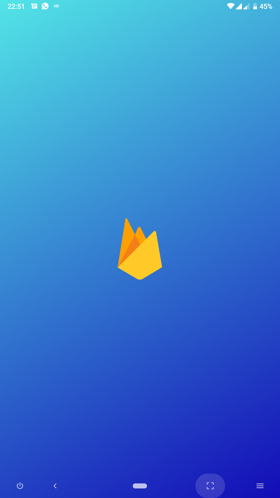
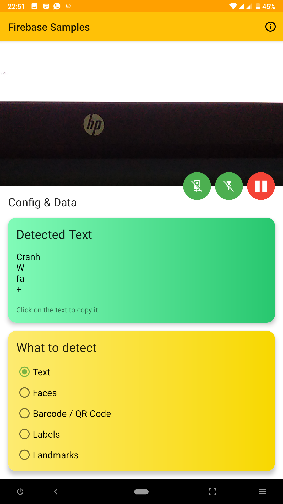
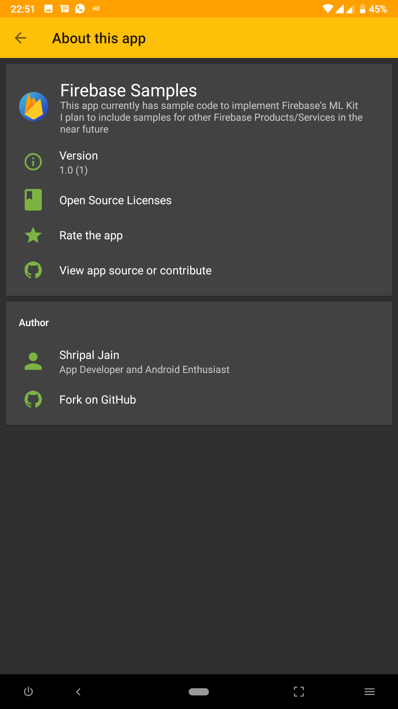

## Firebase Samples

This app currently has sample code to implement Firebase's ML Kit
I plan to include samples for other Firebase Products/Services in the near future
## Getting Started
##### What You'll Need
- Android Device for testing with Android Version 4.1 (API16) or above
- Android Studio's Latest Beta Version (Currently 3.2 RC02)
- Knowledge of Kotlin
- A Firebase Project of your own (google-services.json file to be placed in 'app' directory)

## What has ben implemented
- [x]  Realtime Text Recognition (On-Device)
- [ ]  Text Detection with other languages (Cloud)
- [x]  Realtime Barcode/QR Code Detection (On-Device)
- [x]  Face Detection (On-Device)
- [x]  Image Labelling (On-Device)
- [ ]  Image Labelling (Cloud)
- [x] Landmarks Recognition (Cloud)

## Screenshots
|Home|Splash|About|
||||

## Download

## Credits
- [Firebase Docs](https://firebase.google.com/docs/ml-kit)
- AOSP
- Constraint Layout
- CardView
- [CoolHue](https://webkul.github.io/coolhue/)
- [Anko](https://github.com/Kotlin/anko)
- [CameraView](https://github.com/natario1/CameraView)
- [Runtime Permission Kotlin](https://github.com/florent37/RuntimePermission)
- [Android Material Play Pause View](https://github.com/OHoussein/android-material-play-pause-view)
- [Material About Library](https://github.com/daniel-stoneuk/material-about-library)
- [About Libraries](https://github.com/mikepenz/AboutLibraries)
- [SwitchIcon](https://github.com/zagum/Android-SwitchIcon)
- [Android Iconics](https://github.com/mikepenz/Android-Iconics)

## Development
Want to contribute? Great!
Just create PRs and I'll merge them if they are useful
## License
   Copyright 2018 Shripal Jain

   Licensed under the Apache License, Version 2.0 (the "License");
   you may not use this file except in compliance with the License.
   You may obtain a copy of the License at

       http://www.apache.org/licenses/LICENSE-2.0

   Unless required by applicable law or agreed to in writing, software
   distributed under the License is distributed on an "AS IS" BASIS,
   WITHOUT WARRANTIES OR CONDITIONS OF ANY KIND, either express or implied.
   See the License for the specific language governing permissions and
   limitations under the License.
